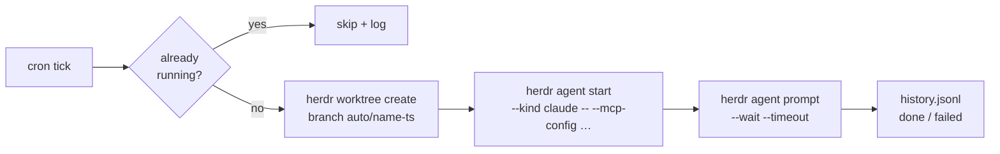

# herdr-automations

**Cron for your coding agents.** Schedule a prompt — Herdr wakes an agent in a fresh worktree and runs it. While you sleep.

[](LICENSE)
[](go.mod)
[](https://herdr.dev)

```yaml
automations:
  - name: issue-triage
    cron: "0 9 * * 1-5"
    repo: ~/Projects/myapp
    prompt: |
      Triage new GitHub issues: label them, close duplicates,
      draft replies for the ones needing more info.
```


That's the whole feature. Every weekday at 9:00, a Claude (or Codex, or opencode…) agent spawns in a fresh git worktree of `myapp`, gets that prompt, and works until it's done. You arrive to triaged issues and a run log.

## Why

[Herdr](https://herdr.dev) keeps your agents alive when you close the laptop — but *you* still have to start them. Recurring chores (issue triage, dependency bumps, nightly test-flake hunts, changelog drafts) deserve better than you retyping the same prompt every morning.

`herdr-automations` is the **trigger layer** the ecosystem was missing:

|  | [herdr-workflows](https://github.com/aorumbayev/herdr-workflows) | **herdr-automations** |
|---|---|---|
| Answers | *"what steps to run?"* | *"**when** to run them?"* |
| Model | multi-step YAML workflows, run on demand | prompt + cron, fired on schedule |
| Together | `workflow: nightly-deps` in an automation runs a herdr-workflows workflow on a schedule | |

## Highlights

- **One YAML entry per automation** — no DSL, no UI required, versionable
- **Fresh worktree per run** (branch `auto/<name>-<timestamp>`), or the repo root — your working copy is never touched
- **One workspace for all of them** — root-mode runs land as tabs in a shared `Automations` workspace, so ten automations don't bury the workspaces you actually drive
- **Agent-agnostic** — anything `herdr agent start` supports: `claude`, `codex`, `opencode`, `gemini`, `cursor`, …
- **MCP attach** — `mcp_config: path.json` hands the agent its MCP servers (GitHub, Slack, your DB…)
- **Overlap guard** — a tick that fires while the previous run is still working is *skipped*, never queued into a pile-up
- **Survives sleep** — occurrences are computed off the wall clock, so a run due while the laptop slept fires on wake (within `catch_up_minutes`) instead of vanishing; anything too late is recorded as `missed`
- **Full run history** — append-only JSONL: `scheduled → running → done | failed | skipped | missed`, with workspace and pane IDs to jump back into
- **Self-updating daemon** — it re-executes itself when the plugin binary changes, and a PID lock keeps a second scheduler from double-firing everything
- **Live board** — an overlay pane inside Herdr: next run, last status, `r` to run now, `enter` to jump straight into the workspace a run created
- **Agents can self-schedule** — a bundled [skill](skills/creating-automations/SKILL.md) teaches Claude Code the format: say *"bump my deps every night"* and the agent writes the entry itself
- **One static Go binary** — no Node, no Python, no runtime on the machine

## Quick start

```bash
herdr plugin install DnzzL/herdr-automations   # prebuilt binary, no toolchain needed
herdr-automations add                          # wizard: validates cron, previews next 3 runs
```

Prebuilt for macOS and Linux (arm64/amd64), checksum-verified at install; anything
else builds from source and needs Go.

**Three ways to add an automation**, all writing the same file:

1. `herdr-automations add` — the wizard: validates the cron and previews the next three runs

   

2. **Edit the YAML** — `herdr plugin config-dir dnzzl.automations` → `automations.yaml`
   (or press `e` on the board to open it at the right line). Full reference in
   [`automations.example.yaml`](automations.example.yaml)
3. **Ask your agent** — see below

The daemon picks up edits within 30 seconds, no restart.

```bash
herdr-automations list             # schedule + last run per automation
herdr-automations run issue-triage # trigger now, don't wait for cron
herdr-automations history         # what ran, when, how it ended
```

### Let your agent do the scheduling

The plugin ships a skill that teaches coding agents this file format. Agents only
discover skills under `~/.claude/skills`, so install it once:

```bash
herdr-automations install-skill      # symlinks into ~/.claude/skills
```

Then, in any new agent session, plain language is enough:

> *"Every Monday at 9am, review the open PRs and tickets on myapp and propose a sprint."*

> *"Schedule a nightly dependency bump on myapp — run the tests and open a PR if they pass."*

> *"Stop the flaky-hunt automation for now."*

The agent writes the YAML entry, and the daemon picks it up within 30 seconds. It's
a symlink, so plugin upgrades update the skill too.

### The board, inside Herdr

A live overlay listing every automation with its next run and last status:

```bash
herdr plugin pane open --plugin dnzzl.automations --entrypoint board --placement overlay
```

| Key | Does |
|---|---|
| `enter` | **Jump to the last run** — focuses the workspace that automation spawned, so you land right in the agent's terminal |
| `h` | **Past runs** — when each ran, how it ended, `enter` to page through the output it left. The only way back to a run whose pane has been retired |
| `r` | Run the selected automation now |
| `e` | Open `automations.yaml` in `$EDITOR`, **cursor on that automation's line** |
| `j` / `k` | Move · `q` closes |

Bind it to a chord so you never type that command again — in `~/.config/herdr/config.toml`:

```toml
[[keys.command]]
key = "prefix+a"
type = "shell"
command = "herdr plugin pane open --plugin dnzzl.automations --entrypoint board --placement overlay"
```

The plugin also registers an action (`herdr plugin action invoke run-now --plugin dnzzl.automations`)
that prompts for which automation to fire.

## How a run works



Everything goes through the `herdr` CLI — the same socket API agents themselves use. No private hooks, nothing to break on Herdr upgrades.

## Full entry reference

```yaml
max_concurrent: 2                 # runs in flight at once; -1 for no limit.
                                  # Ten entries sharing a 07:00 occurrence
                                  # otherwise start ten agents in one second.
automations:
  - name: issue-triage            # unique, kebab-case
    cron: "0 9 * * 1-5"           # 5-field crontab, or @daily / @hourly / @weekly
    repo: ~/Projects/myapp
    workspace: worktree           # worktree (default) | root
    placement: shared             # shared: a tab in the "◷" workspace
                                  # (default for root runs) | workspace: its own
                                  # (forced for worktree runs)
    agent: claude                 # any `herdr agent start --kind`
    prompt: "…"                   # OR workflow: <name>  (delegates to hwf run)
    mcp_config: ~/.config/mcp/github.json   # optional → --mcp-config
    agent_args: ["--model", "opus"]         # optional, verbatim agent flags
    env:                          # optional: exported into the pane's shell
      MCP_TIMEOUT: "60000"        # before the agent starts, for the knobs it
                                  # only reads from the environment
    keep: 1                       # finished runs holding a pane; 0 closes on
                                  # finish, -1 never retires
    keep_failed: 3                # same, for runs that failed
    timeout_minutes: 60           # optional bound on the run
    catch_up_minutes: 120         # how late a sleep-delayed run may still start; -1 never
    disabled: true                # optional: keep it, don't schedule it
    once: true                    # optional: retire it once a run finishes
```

## FAQ

**Does my machine need to be awake?** For the run to start, yes — and laptops sleep.
So the scheduler works off the wall clock, not a timer: an occurrence that came due
while the machine was asleep **runs when it wakes**, as long as it's within
`catch_up_minutes` (default 2 hours). Anything older is recorded as `missed` in the
history rather than silently skipped, so `herdr-automations history` always tells you
what didn't happen. Set `catch_up_minutes: -1` for automations that are pointless late.

Timers alone don't survive sleep — macOS suspends the monotonic clock, so a job armed
for 9am Monday can simply never fire. Hence the wall-clock loop.

**Do the panes pile up?** No — each automation keeps its last `keep` runs (default
1) and its last `keep_failed` failures, and retires the rest. The retiring happens
when that automation *next starts*, which is what makes one setting fit every
schedule: a weekly automation's pane stays up for a week, an hourly one's for an
hour, with no TTL to tune. A global "keep the last 20 runs" cannot do that — the
hourly automations would evict the weekly one within hours. A pane you are looking
at is never closed under you; it goes on the next round instead.

**What happens to the worktrees?** Retiring a worktree run closes its workspace,
but the branch and checkout stay: each run is still a branch you can inspect,
merge, or `herdr worktree remove`. Auto-cleanup of merged runs is on the roadmap.

**Can I schedule something to run just once?** Add `once: true` and give it a cron
saying when to try. The automation retires itself after a run *finishes* — the
schedule state remembers it, so the file needs no edit afterwards and the entry can
sit there as a record of what was done. A run that fails doesn't spend it: `once`
means the work has to happen, not that the moment has to be spent, so the next
occurrence still gets a turn. Pick the cron with that in mind — `0 3 20 8 *` retries
next year, `@daily` retries tomorrow.

**Event triggers (on push, on PR, on `worktree.created`)?** Planned — Herdr's plugin manifest already supports `[[events]]`; cron came first because it's 90% of the value.

## Development

```bash
go build -o bin/herdr-automations . && go test ./...
herdr plugin link .        # use your checkout as the installed plugin
```

PRs welcome — especially new event triggers, run cleanup policies, and agent kinds tested in the wild.

## License

[MIT](LICENSE)
